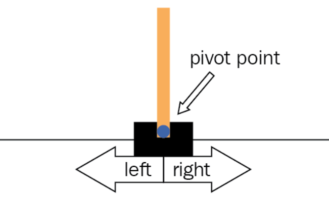

# Policy Gradients

In Reinforcement Learning, we build autonomous agents to complete some task. In this case, we will be training an agent to play the game of CartPole. CartPole is a simple game where a pole is attached to a cart. The goal of the game is to balance the pole on the cart. The cart can move left or right. The game ends when the pole falls over or the cart moves out of bounds. The game is considered solved when the agent can balance the pole for 200 consecutive episodes. 

This game is very simple and is not focus of this repo. So, our focus will be construct Agent from scratch using some type algorithm like Policy Gradient and to prove all math that will all of this work. We will use tensorflow to build our agent and Gymnasium (Gym) to provide environment. So, lets hands on!

# Algorithm and math

Our focus is use Policy Gradient to train our agent. So, we will use some math to prove that this algorithm works. So, lets start with some math. First, if we want use gradient discent methods, we need to know how to calculate gradient. So, lets start with that. Lets see how formula for gradient looks like:

$$\theta^{'} \leftarrow \theta - \eta \nabla_{\theta} J(\theta)$$

$$\nabla_{\theta} J(\theta) = \frac{\partial J(\theta)}{\partial \theta}$$

Where $\theta$ is parameters of our model and $J(\theta)$ is our return function. So, lets see how we can calculate gradient for our return function.

## 1) Probabilities of trajectory

$$P(\tau|\pi) = P(s_0, a_0, s_1, a_1, ...|\pi)$$

$$P(\tau|\pi) = P(s_0|\pi)P(a_0|s_0, \pi)P(s_1|s_0, a_0, \pi)P(a_1|s_1, \pi)P(s_2|s_1, a_1, \pi)P(a_2|s_2, \pi)...$$

$$P(\tau|\pi) = \rho_0 (s_0) \prod_{t=0}^{T-1} P(s_{t+1} | s_t, a_t) \pi(a_t | s_t)$$

## 2) Expected return

$$G_t = \sum_{k=0}^{\infty} \gamma^k r_{t+k+1}$$

## 3) Policy Gradient

$$\nabla_\theta J(\theta) = \mathbb{E}_{\tau \sim \pi_\theta} \left[ \sum_{t=0}^{T-1} \nabla_\theta \log \pi_\theta(a_t|s_t) G_t \right]$$

## 4) Policy Gradient Theorem

$$\nabla_\theta J(\theta) = \mathbb{E}_{\tau \sim \pi_\theta} \left[ \sum_{t=0}^{T-1} \nabla_\theta \log \pi_\theta(a_t|s_t) \sum_{k=0}^{\infty} \gamma^k r_{t+k+1} \right]$$

## 5) Policy Gradient Theorem

